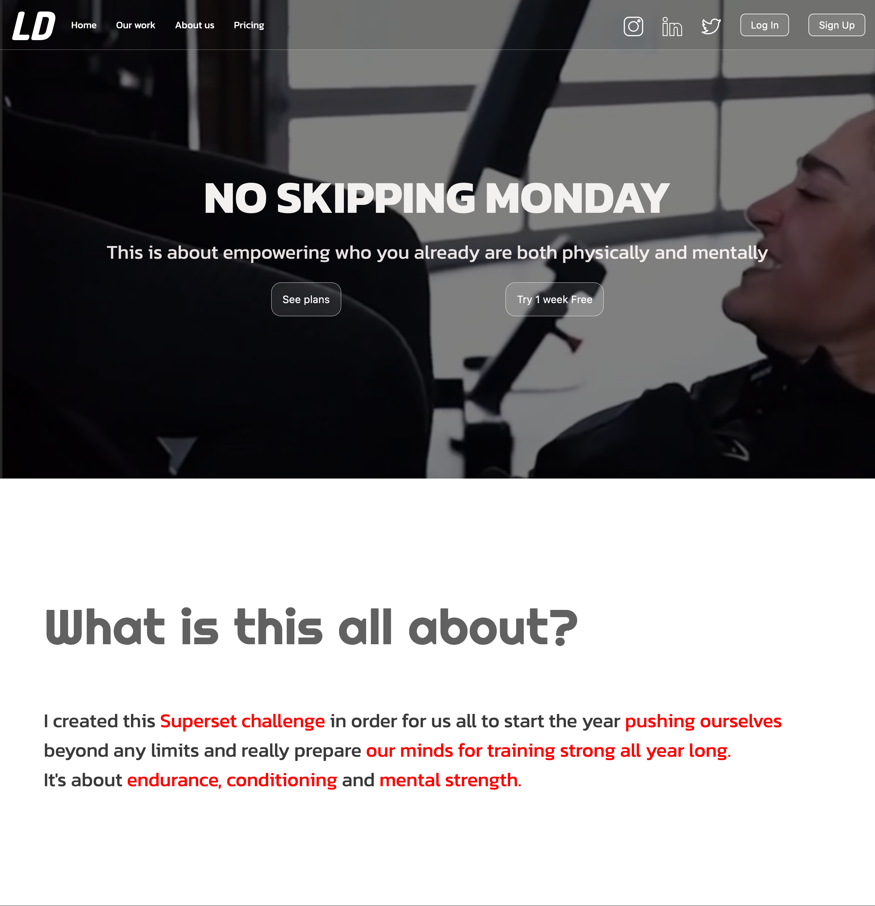
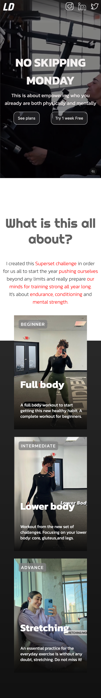

Hey. Welcome to my web development project. Currently in development. 

## Table of contents

- [Overview](#overview)
  - [The challenge](#the-challenge)
  - [Screenshot](#screenshot)
  - [Links](#links)
- [My process](#my-process)
  - [Built with](#built-with)
  - [What I learned](#what-i-learned)
  - [Continued development](#continued-development)
  - [Useful resources](#useful-resources)
- [Author](#author)
- [Acknowledgments](#acknowledgments)

## Overview

### I challenge myself to:

Create a web page where users should be able to:

- View the optimal layout for the section depending on their device's screen size

### Screenshot

### Links

- Code: [GitHub Repository](https://github.com/yefreescoding/Redesign-web-page.git)
- Live Site URL: [Vercel Live Site](https://redesign-web-page.vercel.app/)

## My process

### Built with

- Semantic HTML5 markup
- CSS custom properties
- Flexbox
- CSS Grid
- Mobile-first workflow
- SASS

### What I learned

One of the things I've learned with this project is first of all being more organized. How to structure my job to speed up my workflow. The correct implementation and the tags of the HTML document.

### Continued development

Use this section to outline areas that you want to continue focusing on in future projects. These could be concepts you're still not completely comfortable with or techniques you found useful that you want to refine and perfect.

### Useful resources

## Author

- Website - [Yefree De Los Santos](#)
- GitHub - [@yefreescoding](https://github.com/yefreescoding)
- Twitter - [@YefreeCodes](https://twitter.com/YefreeCodes)

## Acknowledgments

This is where you can give a hat tip to anyone who helped you out on this project. Perhaps you worked in a team or got some inspiration from someone else's solution. This is the perfect place to give them some credit.
